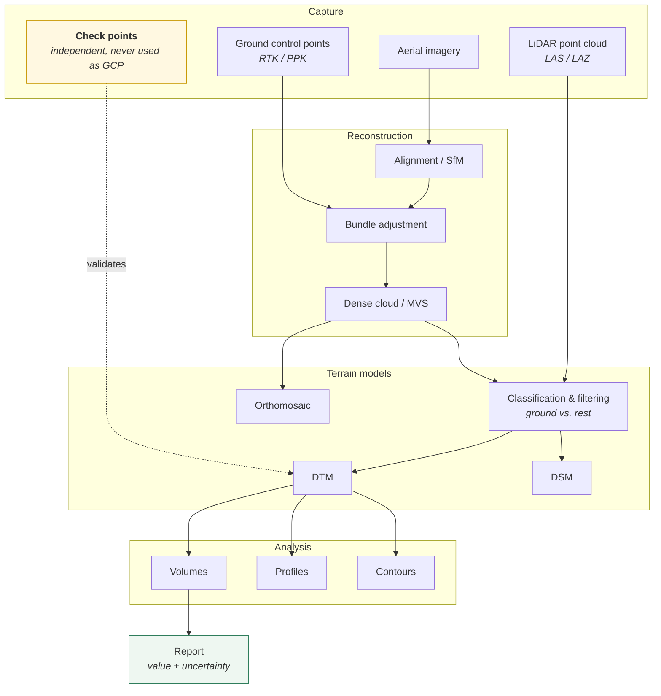
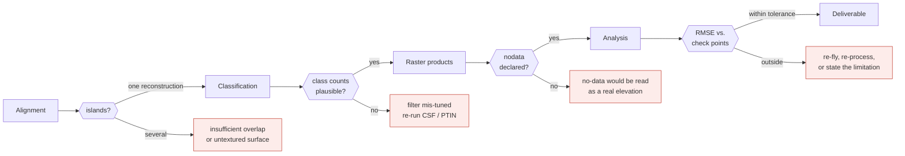
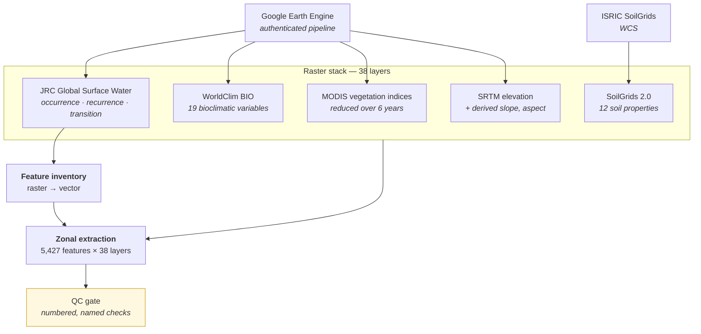

# Architecture

## Contents

- [The pipeline](#the-pipeline)
- [Quality gates](#quality-gates)
- [The two branches: photogrammetry and LiDAR](#the-two-branches-photogrammetry-and-lidar)
- [Derived products](#derived-products)
- [Automation](#automation)
- [The book as part of the system](#the-book-as-part-of-the-system)

---

## The pipeline

From a flight to a signed number, with the checks that make the number defensible.

The dotted edge is the important one. Check points enter **only** at validation, never at
reconstruction. Keeping those two arrows separate is the difference between a measured
accuracy and a self-fulfilling one — see
[ADR-001](decisions/ADR-001-validation-with-independent-check-points.md).

---

## Quality gates

Four checks, placed where an error is still cheap to fix. Each is a small script; none
takes more than a minute to run.

**Alignment.** Reads the reconstruction and counts how many separate reconstructions came
out of it. More than one means "islands" — sub-reconstructions that never merged, caused
by insufficient overlap or untextured surfaces such as water or fresh asphalt. This is the
most common cause of a subtly wrong model, and it is invisible in the finished product.

**Classification.** Counts points per ASPRS class after filtering, so a mis-tuned ground
filter is caught *before* a DTM is derived from the wrong points rather than after the
volume is delivered.

**Nodata.** Reports how nodata is declared and what fraction of the raster holds real
data. The minimum check before any analysis, so a no-data sentinel is never averaged in as
if it were an elevation.

**Vertical datum.** Reports which vertical datum a raster declares, and whether two rasters
are comparable in height at all. Ellipsoidal against orthometric heights differ by the
geoid undulation — roughly 15 to 30 m in Argentina — and that mismatch passes every other
guard silently. Undeclared is treated as indeterminate, never as agreement. See
[ADR-009](decisions/ADR-009-verify-the-vertical-datum.md).

**Accuracy.** Vertical RMSE against independent check points, sampling the raster at each
check location and warning explicitly when a point falls outside the flight extent instead
of silently dropping it.

---

## The two branches: photogrammetry and LiDAR

Different sensors, converging on the same terrain products.

| | Photogrammetry | LiDAR |
|---|---|---|
| Input | overlapping imagery | LAS/LAZ point cloud |
| Reconstruction | SfM → bundle adjustment → MVS | already 3D at capture |
| Vegetation | surface only; cannot see through canopy | multiple returns reach ground |
| Ground extraction | filtering on a derived cloud | filtering on measured returns |
| Cost | low | high |
| Typical use | stockpiles, quarries, bare earth | vegetated terrain, corridors |

Both converge at classification, and from there the toolchain is identical. That
convergence is a deliberate design property: analysis scripts consume a DTM without caring
how it was produced, so a project can switch sensors without changing the analysis.

The book covers both, plus the newer reconstruction approaches — Gaussian splatting and
NeRF — as their own chapters, since they are becoming relevant and are not yet part of
standard practice.

---

## Derived products

Analysis operates on rasters, in NumPy, through GDAL and rasterio.

**Volumes** come in two cases, deliberately kept as two scripts:

- *Against a horizontal reference plane* — a stockpile on a known flat base, or a
  simplified design subgrade. Takes the reference elevation and, optionally, the vertical
  RMSE, and returns cut and fill with propagated uncertainty.
- *Between two terrain models* — as-built against design, with variable slope. Validates
  that both rasters share resolution and CRS before subtracting, and refuses if they do
  not.

The first script's docstring names the second for the case it does not handle. A script
that tells you where to go when it is the wrong tool is worth more than one that quietly
does something approximate.

**Profiles** sample elevation along a trace between two points, at a requested number of
samples — longitudinal or cross-sectional, the same operation either way.

**Contours, areas and reports** complete the set. All of it lands in formats the client's
existing GIS and CAD tools already open.

---

## Satellite data engineering

A second pipeline, different in kind from the drone work: instead of producing terrain
models from a flight, it assembles a multi-source environmental raster stack over a
region and extracts per-feature profiles from it. Built for a habitat-suitability study
covering a Patagonian plateau.

**The inventory step is raster-to-vector at scale.** A surface-water layer is binarised at
several thresholds, connected components are labelled, small artefacts are filtered by
minimum area, the result is vectorised to polygons, reprojected to a metric CRS for
measurement, and matched against known locations. Five thousand four hundred and
twenty-seven distinct water bodies come out of a satellite image.

**Extraction is zonal, buffered, and QC-gated.** Each feature gets a buffer, derived
terrain variables are computed, and every layer is summarised within each polygon. The
output is a feature-by-variable matrix — and a QC report of numbered checks that must pass
before the matrix is used.

Three practices carry over from the drone pipeline, and one is new:

**A fail-fast pre-check before the expensive step.** Before processing an entire region,
the pipeline verifies that the signal is present at a location known to have it. If the
reference site does not show water in the water layer, something is wrong with the
extraction and there is no point spending an hour discovering that at the end.

**Named, numbered QC checks with recorded values.** Not a boolean pass. Each check states
what it tested and what it found — missing-value rate per variable, completeness at the
reference site, whether elevation falls in a plausible range for the region — and the
record is written to disk as evidence.

**Thresholds are parameters, not constants.** The binarisation thresholds are command-line
arguments with documented defaults, because the right threshold is a judgement about the
region and belongs to the operator.

**Every layer declares its provenance** — the new one, and the most valuable. See
[ADR-011](decisions/ADR-011-every-layer-declares-its-provenance.md).

---

## Automation

Processing is driven through OpenDroneMap's REST API rather than its web interface:
authenticate, create the project, upload the imagery, trigger the task, poll to
completion, and fail loudly on the documented failure and cancellation states rather than
polling forever.

The polling loop treats the API's status codes as the contract they are, and the client is
small on purpose — enough to make the pipeline unattended and repeatable, not a wrapper
around the whole API. See [ADR-007](decisions/ADR-007-automate-through-the-api.md).

---

## The book as part of the system

Sixty-seven chapters, seven parts, written in Markdown and built with Quarto to PDF via
LaTeX.

| Part | Covers |
|---|---|
| I — Fundamentals | photogrammetric history, geodesy and reference systems, camera geometry, SfM, MVS, LiDAR principles, Gaussian splatting and NeRF |
| II — Hardware | UAVs, sensors, cameras, GNSS, RTK and PPK, classical survey instruments, aerial and handheld LiDAR |
| III — Software & workstation | Linux, CPU, GPU, RAM, storage, the processing stack |
| IV — Processing | alignment, bundle adjustment, DSM, DTM, DEM, orthomosaics, 3D models, quality control, LiDAR classification |
| V — GIS | raster, vector, GeoPackage, GeoTIFF, contours, profiles, areas, volumes, reports |
| VI — Automation | Docker, Bash, Python, APIs, batch processing |
| VII — Case studies | road works, stockpiles, quarries, agriculture, conservation, wetlands |
| Annexes | worked cases, a client-to-deliverable practical guide, platform comparison |

Every script cites the part and chapter it implements, in its own docstring, so a reader
who reaches the theory finds the working implementation and a user who runs the script
finds the reasoning. That coupling is the point — see
[ADR-006](decisions/ADR-006-code-and-text-as-one-artefact.md).
